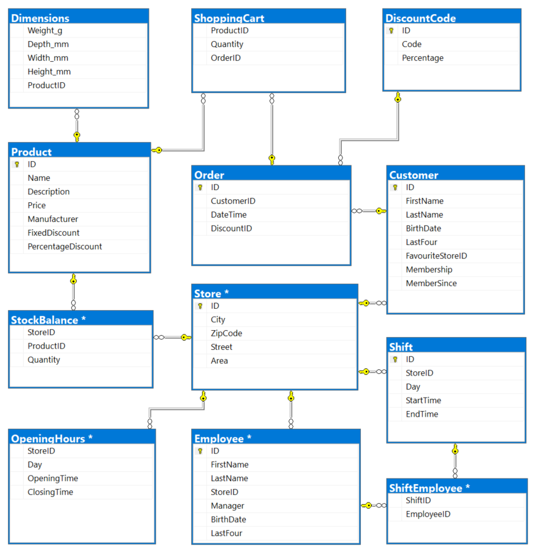

# Design Process: ICA Store (Swedish)

> En SQL-databas över en matvarukedja med ett utgångsläge av tre stycken butiker, 11 anställda,två-tre skift per butik, ett mindre produktutbud samt tre butikschefer.

## Strukturen

Grundläggande struktur var given i
projektbeskrivningen så första delen av
designen gick fort där vi började med en
mockup i excel över databasens delar utefter
projektbeskrivning.

## Relationer

Vi tänkte ganska likt med kopplingarna mellan tabellerna men det som var svårt var att få ihop Product och Customer med Order samt hur vi skulle göra fungerande arbetsscheman mellan Store och Employee.

<!--  -->

## Arbetsschemat

Löste vi genom att göra en ny
tabell **”Shift”** som höll alla skiften som de
anställda kunde jobba på. Det går att lägga till
obegränsat med skift per butik och dag men de
kan inte sträcka sig över natten vilket kanske är
intressant i undantagsfall om det är någon
speciell kampanjhelg. Lösningen tycker jag
ligger hos butiken att de manuellt kan skriva in
dessa special-pass i ett separat lönesystem,
men om det faktiskt ska startas en dygnet-runt 
öppen affär i kedjan behöver tabellen utökas
med startdag och slutdag med begränsning till
två efterföljande dagar. 

## Ordersystem

Löste vi med en ny tabell 
”ShoppingCart” fördelen är att det går att lägga in flera produkter på varje order. Nackdelen är att det lägger fler krav på applikationerna som hanterar försäljningen i onlineshoppen för att inte extrarader ska skapas eller att applikationerna ska kunna ändra en viss rad. En lösning är att just applikationen håller all information i minnet fram tills själva ordern är klickad hem och alla rader skapas samtidigt.

## Null-värden

Databasen tillåter ”null” enbart för rabatterna och dimensionerna.
Orderrabattkoden kan vara ”null” och produktrabatten måste minst en rabatt vara
”null”. Den senare begränsningen är för att kunna sätta tydligare rabatter för kund,
anställd och databas. Ifall dimensioner saknas eller inte är tillämpbara så ska varan ändå tillåtas. Ett tillägg till ”Dimensions” är att våra restriktioner till mått efter en eu-pall nog är utanför en utvecklares ansvarsområde och kanske borde tas bort i samråd med butikskedjan.

## Utmanande kod

Det mest tidskrävande kodarbetet låg i att begränsa butikscheferna till max en per butik, att en anställd bara skulle jobba ett skift per dag (och butik) samt Query #3. 

### Butikschefer

Vi gjort tabellen så att den anställde enbart kunde vara chef eller inte chef (booleskt värde) och det svåra var att många skulle inte vara butikschef (ha ett null-värde) medans bara en skulle vara det per butik. Vi löste det genom en trigger och källkoden finns på sida 20 i projekt-filen Documentation.pdf. Samma typ av lösning hade behövts även om vi ändrade till flera anställningsformer med en ny tabell. Begränsningen till enbart anställd/chef gjorde vi för att vi genomgående i arbetet velat hålla lösningarna enkla och så nära projekt-specifikationen som möjligt. 

### Ett skift per dag

Här visste vi inte vart vi skulle börja och krävde lite kreativitet för att få fram en fungerade källkod, sida 21 i projekt-filen. Denna trigger behöver göras om ifall butiken börjar med dygnet-runt öppen butik.

## Sammanfattningsvis

Vi klarade att i stort sett hålla de tabeller vi bestämde från start och de relationer som vi beslutade oss för. Att det blev så tror jag var för att vi hade bra struktur från början, vi hade bra diskussioner och båda har jobbat/jobbar i butik. Jag ser dock problem med att vi har en förförståelse/antaganden och att de kan ha påverkat oss att luta mer mot att ändra kod än att ändra i redan lagda struktur.
