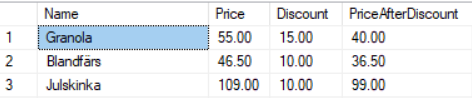

<style>
img {
    padding-top: 40px;
    padding-bottom: 40px;
}
</style>

# Food Chain T-SQL Database

>This is a T-SQL database course in the vocational studies of .NET Developer in Teknikhögskolan, Göteborg.

## Tools

- Microsoft SQL-Server Management Studio

[Design-process (Swedish)](DesignProcess_SWE.md)

## SELECT QUERYS

### Get product with name, price and discount inclusive/exclusive

```SQL
SELECT Name,
Price ,
FixedDiscount AS Discount,
Price - FixedDiscount AS PriceAfterDiscount
FROM Product
ORDER BY FixedDiscount DESC, Product.Name
```



### Get opening hours per day and store

```SQL
SELECT Street, 
CASE 
WHEN OpeningHours.Day  = 0 THEN 'Måndag' 
WHEN OpeningHours.Day  = 1 THEN 'Tisdag' 
WHEN OpeningHours.Day  = 2 THEN 'Onsdag' 
WHEN OpeningHours.Day  = 3 THEN 'Torsdag' 
WHEN OpeningHours.Day  = 4 THEN 'Fredag' 
WHEN OpeningHours.Day  = 5 THEN 'Lördag' 
WHEN OpeningHours.Day  = 6 THEN 'Söndag' 
END
AS WeekDay, OpeningHours.OpeningTime, OpeningHours.ClosingTime

FROM Store
JOIN OpeningHours ON Store.ID = OpeningHours.StoreID
ORDER BY Street, OpeningHours.Day
```


### Get customer with products and sum before discount

```SQL
SELECT
[DateTime],
FirstName,
LastName,
SUM(ShoppingCart.Quantity) As [ProductCount],
SUM(Product.Price * ShoppingCart.Quantity) As [SumBeforeDiscount]
FROM [Product]

JOIN ShoppingCart
ON Product.ID = ShoppingCart.ProductID
JOIN [Order]
ON ShoppingCart.OrderID = [Order].ID
JOIN Customer
ON [Order].CustomerID = Customer.ID

GROUP BY [Order].ID, FirstName, LastName, [DateTime]
ORDER BY [DateTime] DESC
```


### Opening hours per employee and store

```SQL
SELECT Employee.FirstName, Store.Street, OpeningTime, ClosingTime
From Employee
JOIN Store
On Employee.StoreID = Store.ID
JOIN OpeningHours
On Store.ID = OpeningHours.StoreID
```

## Triggers

### One Shift per worker and day

```SQL
CREATE TRIGGER TR_OneShiftPerDay
    ON [ShiftEmployee]
    AFTER INSERT, UPDATE
AS
BEGIN
    SET NOCOUNT ON;

    DECLARE @Val int
    DECLARE @DistVal int

    SET @Val = (
        SELECT COUNT(CONVERT(char, EmployeeID) + CONVERT(char, Day)) 
        FROM [ShiftEmployee]
        JOIN [Shift]
        ON ShiftID = Shift.ID
    )

    SET @DistVal = (
        SELECT COUNT (DISTINCT (CONVERT(char, EmployeeID) + CONVERT(char, Day))) 
        FROM [ShiftEmployee]
        JOIN [Shift]
        ON ShiftID = Shift.ID
    )

    IF(@Val > @DistVal )
        BEGIN
        THROW 50000, 'There can only be one shift per day and store!', 1;
    END
END
```

### Manager Limit trigger

```SQL
CREATE TRIGGER ManagerLimit
ON Employee
AFTER INSERT, UPDATE
AS
BEGIN
    SET NOCOUNT ON;

    IF EXISTS(
        SELECT StoreID, COUNT(Manager)
        FROM Employee
        WHERE Employee.Manager = 1
        GROUP BY StoreID
        HAVING COUNT(Manager) > 1
    )
    BEGIN
        THROW 50000, 'There can only be one manager per store!', 1;
    END
END
```
